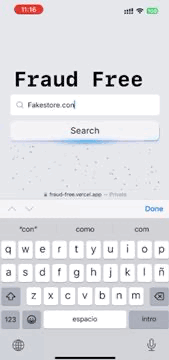
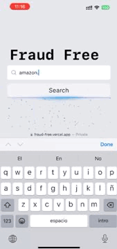
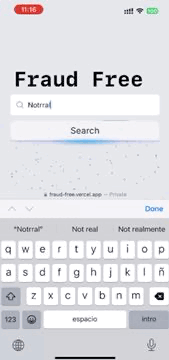

# 🛡️ FraudFree - E-commerce Security & Fraud Detection

[**🖥️ Test Online: Fraud-Free App**](https://fraud-free.vercel.app/)

**TrustCheck** is a comprehensive platform that helps users identify and verify the legitimacy of e-commerce websites. The platform aggregates and analyzes multiple data sources to assess the trustworthiness of websites, generating a risk score based on factors such as domain age, user reviews, and more. This allows users to make more informed decisions when shopping online.

## 🚀 Features

- **Real-time Verification:** Instantly checks websites for risk factors as users browse.
- **Detailed Insights:** Collects and analyzes data from domain registries, review platforms, and more.
- **Custom Risk Levels:** Evaluates websites with a scale from 0 to 10, indicating the level of risk

## 📊 How It Works

TrustCheck leverages data from various sources to generate a comprehensive **Digital Presence Footprint** for e-commerce websites. The platform analyzes:

- **Domain Age and Registration**
- **SSL Certificate Validity**
- **User Reviews**
- **Reputation Score**
- **Social Media Presence**
- **Payment Methods**

The system then generates a fraud probability score and displays a risk level to the user, allowing for better protection while browsing online stores.

## 📂 Example Gifs

### Fake Website (High Scam Probability)


### Legitimate Website (Low Scam Probability)


### Invalid Website (Not a Valid Site)


## 📖 Installation

1. **Clone the repository:**
```bash
git clone https://github.com/yourusername/trustcheck.git
cd trustcheck
```

2. **Install dependencies:**
```bash
npm install
```

3. **Start the development server:**
```bash
npm run dev
```

4. **Access the application:**
   Open your browser and navigate to [http://localhost:3000](http://localhost:3000).

## 🛠️ Tech Stack

- **Next.js** - A powerful React framework for building dynamic web applications.
- **TailwindCSS** - A utility-first CSS framework for fast UI development.
- **Framer Motion** - For smooth animations.
- **NestJS** - Powerfull API, check the [api on github](https://github.com/HackYeahKabanosy/fraudfree).
- **Vanilla JS** - The tasty way to create our plugin for chrome and firefox, [check on github](https://github.com/HackYeahKabanosy/fraudfree/tree/main/browser_plugin/mozilla).
- **MongoDB** - A NoSQL database for storing website information.

## 📚 License

This project is licensed under the MIT License - see the [LICENSE](LICENSE) file for details.
